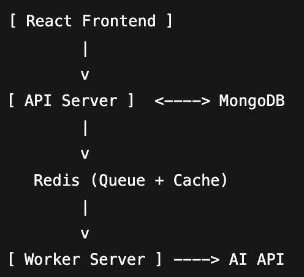

# StudyFlow
DevPost: https://devpost.com/submit-to/25829-united-hacks-v6/manage/submissions

StudyFlow is an intelligent study assistant platform designed to enhance learning by leveraging AI-powered tools. It allows users to organize, manage, and interact with study content efficiently, using a combination of a React frontend, API server, Redis queue/cache, and worker server integration with AI APIs.

---

## Architecture

The system is designed with a modular and scalable architecture:

**Components:**

1. **React Frontend**
   - Provides an intuitive user interface for students to interact with StudyFlow.
   - Communicates with the API server to fetch and submit data.

2. **API Server**
   - Handles requests from the frontend.
   - Manages business logic and user data.
   - Connects to MongoDB for persistent storage.
   - Interacts with Redis for caching frequently accessed data and queueing tasks for asynchronous processing.

3. **Redis**
   - Serves as a cache to speed up frequent data retrieval.
   - Acts as a message queue to manage tasks processed by the Worker Server.

4. **Worker Server**
   - Processes queued tasks asynchronously.
   - Interacts with external AI APIs to provide intelligent responses or generate study content.

5. **MongoDB**
   - Stores all persistent application data, including user information, study materials, and analytics.

---

## Features

- AI-powered study assistance (via external AI APIs)
- Real-time task processing with Redis queues
- Scalable and modular architecture
- Persistent data storage using MongoDB
- Responsive UI built with React

---

## Getting Started

### Prerequisites

- Node.js >= 18.x
- MongoDB
- Redis
- API keys for AI services

### Installation

#### 1. Clone the repository:

- bash
- git clone https://github.com/your-username/StudyFlow.git
- cd StudyFlow

#### 2. Install dependencies for each service:

Frontend:
- cd frontend
-npm install

API Server:
- cd ../api-server
- npm install

Worker Server:
- cd ../worker-server
- npm install

#### 3. Set up environment variables:

API Server: .env

- AUTH0_DOMAIN=<your-domain>
- AUTH0_AUDIENCE=<your-audience>
- MONGO_URI=<your-mongo-uri>
- REDIS_URL=<your-redis-url>

Worker Server: .env

- MONGO_URI=<your-mongo-uri>
- REDIS_URL=<your-redis-url>
- OPENAI_API_KEY=<your-ai-api-key>

Frontend: .env

- VITE_AUTH0_DOMAIN=<your-domain>
- VITE_AUTH0_CLIENT_ID=<your-client-id>
- VITE_AUTH0_AUDIENCE=<your-audience>

## Contributing

Contributions are welcome! Please fork the repository and submit a pull request.

## License

This project is licensed under the MIT License.